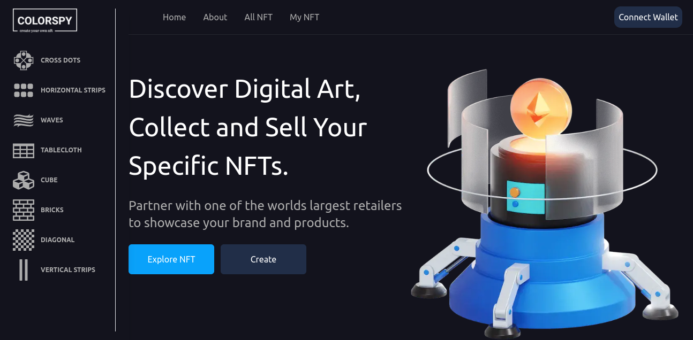
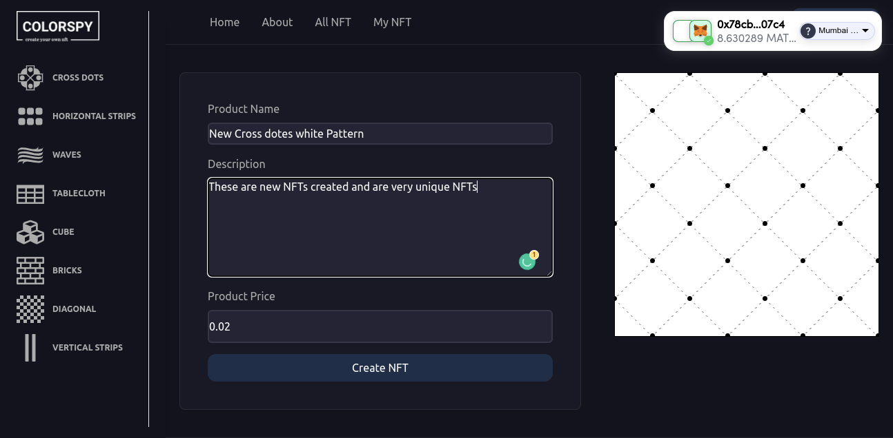
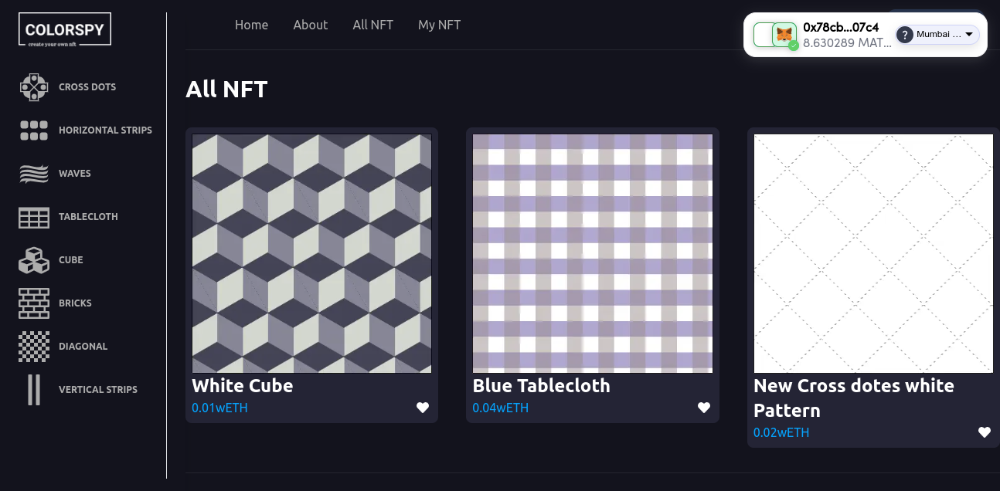
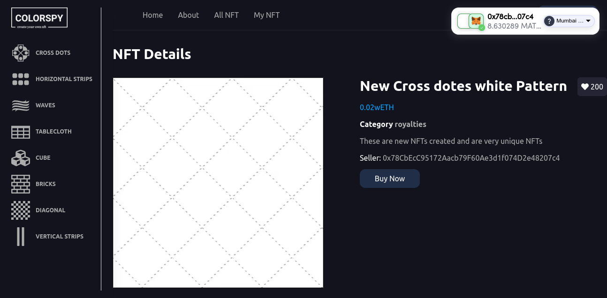

<!-- Run in Your local environment -->

# Prerequisites

* [nodejs](https://nodejs.org/en/download/)
* [MetaMask](https://chrome.google.com/webstore/detail/metamask/nkbihfbeogaeaoehlefnkodbefgpgknn) Chrome extension installed in your browser
* [Hardhat](https://hardhat.org/) for local smart contracts deployement and testing
* [nft.storage](https://nft.storage/) account for IPFS storage (free account).
* [polygon(mumbai)](https://faucet.polygon.technology/) Polygon mumbai balance for your smart contract deploy and NFT mint

## How to run in your Local environment

<dl>
    <dt>Step1: Clone GitHub Project on your PC</dt>
    <dd>
        
git clone https://github.com/nayanrdeveloper/polygon_design_nft_marketplace

    </dd>
    <dt>Step2 (deploy smart contract):</dt>
    <dd>
        
go to the project folder polygon_design_nft_marketplace/backend and run following command

        
npm install

    </dd>
    <dt>Step-3: </dt>
    <dd>
        
npx hardhat compile

        
This Project is used to hardhat for smart contract deploy

    </dd>
    <dt>Step-4 :  </dt>
    <dd>
        
npx hardhat run --network mumbai  scripts/deploy.js

        
When this command run after showing the console the following result

        
Marketplace deployed address are   0x54gdf54757gfjfgj457547547

        
MyToken deployed address are 0Xfdghfh34n5bghv859gkd34Sth

    </dd>
    <dt>Step-5: </dt>
    <dd>
        
Step - 4 is deploying your smart contract in a polygon (mumbai) network.

        
now go to the polygon_design_nft_marketplace directory and change the file env.example to .env and update the following changes

        
NEXT_PUBLIC_NFTTOKN_CONTRACT_ADDRESS = "add MyToken deploy address"

        
NEXT_PUBLIC_MARKETPLACE_CONTRACT_ADDRESS = "add  marketplace deploy address "

        
NEXT_PUBLIC_API_KEY = "get polygon mumbai API key"

        
NEXT_PUBLIC_NFT_STORAGE_KEY = "NFT Storage API Key"

    </dd>
    <dt>Step - 6: </dt>
    <dd>
        
npm install

        
npm run dev

        
Open your Project in browser (http://localhost:3000/)

    </dd>
</dl>

### Built With
* [Solidity](https://docs.soliditylang.org/)
* [Hardhat](https://hardhat.org/getting-started/)
* [Next.js](https://nextjs.org/)
* [ethers.js](https://docs.ethers.io/v5/)
* [web3-Onboard](https://docs.blocknative.com/onboard)
* [TailwindCss](https://tailwindcss.com/)

#### User interface
   
The front end is built with Next JS it's framework of React, it allows users to mint new NFTS and they can find on the home page a complete roadmap for the entire NFT project, the app also give a simple admin dashboard for setting minting prices and managing the sales period.

The front-end is built using the following libraries:
      <ul>
        <li><b>Ethers.js:</b> used as interface between the UI and the deployed smart contract</li>
        <li><b>Web3-Onboard:</b> for conecting to Metamask(wallet)</li>
        <li><b>mobx:</b> for managing the app states (account, balance, blockchain) </li>
        <li><b>Tailwind CSS:</b> Styles using TailwindCss</li>    
      </ul>

Create design pattern

_2.png)

Connect Wallet

.png)

Create New NFT

All NFTs

NFT Details

About

